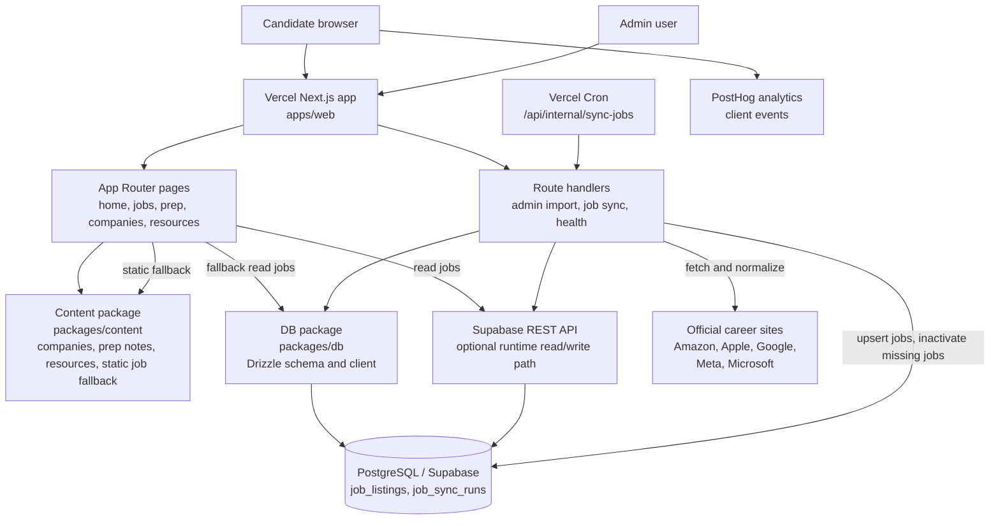

# Architecture

Big Five Career Hub is a small monorepo centered on a Next.js app, shared content, and a PostgreSQL-backed job store. The production runtime is designed for Vercel, with static content available at build time and dynamic job data loaded from Supabase REST or PostgreSQL when configured.

## Main Components

- `apps/web`: Next.js App Router application with public pages, admin pages, and API route handlers.
- `packages/content`: build-time content for company hubs, prep notes, official resources, role families, and static job fallback data.
- `packages/db`: Drizzle schema and lazy database client for PostgreSQL-backed runtime storage.
- `data/job-imports`: checked-in official career-page snapshots used as a no-database fallback.
- `drizzle`: database migrations for row-level security and job sync run storage.

## Data Flow

1. Candidates browse pages rendered by `apps/web`.
2. Job pages call `getJobs()` / `getJobBySlug()` and prefer Supabase REST when `SUPABASE_URL` and `SUPABASE_SERVICE_ROLE_KEY` exist.
3. If Supabase REST is unavailable, runtime can read PostgreSQL directly through `DATABASE_URL`, except during production builds.
4. If no database read path is available, the app falls back to the checked-in official career-page snapshot.
5. Admin imports validate CSV/JSON through `parseImportText()` and persist via Supabase REST or PostgreSQL.
6. Vercel Cron calls `/api/internal/sync-jobs`, which fetches official career pages, normalizes listings, upserts active jobs, and records sync runs.

## Deployment Shape

- Hosting: Vercel
- Framework: Next.js 15 App Router
- Runtime storage: PostgreSQL, with Supabase REST supported for hosted reads/writes
- Scheduled work: Vercel Cron at `/api/internal/sync-jobs`
- Analytics: PostHog client provider

## Important Runtime Fallbacks

- Production builds avoid direct PostgreSQL reads so static generation does not require runtime secrets.
- Public job reads use Supabase REST first, PostgreSQL second, and static checked-in jobs last.
- Admin and sync writes use Supabase REST when service-role configuration is present; otherwise they use PostgreSQL.
